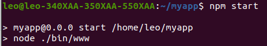
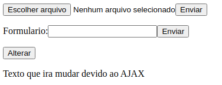
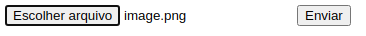
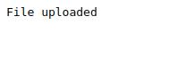
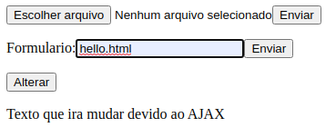
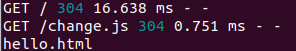
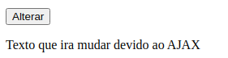
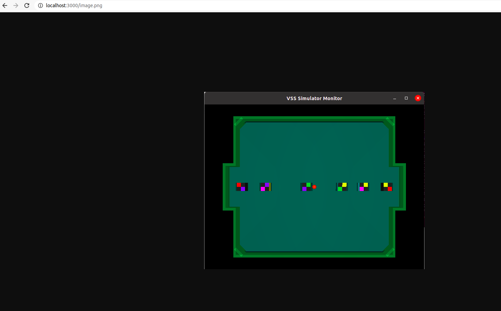

Sistema Operacional utilizado: Ubuntu 20.04

Para executar a aplicação utilizar o seguinte comando:

Durante a execução em **http://localhost:3000/** aparecerá a seguinte tela inicial:

Para dar o upload de arquivos clique em **Escolher arquivo** e depois de escolhe-lo clique em **Enviar** logo ao lado.

Se o upload for feito com sucesso aparecerá a seguinte mensagem:

Já para a parte do processamento do formulário, depois de enviar um formulário, o texto presente neste formulário é imprimido no terminal.

E por último ao apertar no botão **Alterar** a frase **Texto que ira mudar devido ao AJAX** será substituída por uma frase dentro do arquivo JSON **newtext.json**

Para ver os arquivos estáticos disponíveis basta escrever seus nome na url como **http://localhost:3000/image.png**.

Inicialmente os únicos arquivos estáticos disponiveis são **image.png** e **change.js**, mas todos os arquivos usados para upload ficam disponiveis como estáticos.
